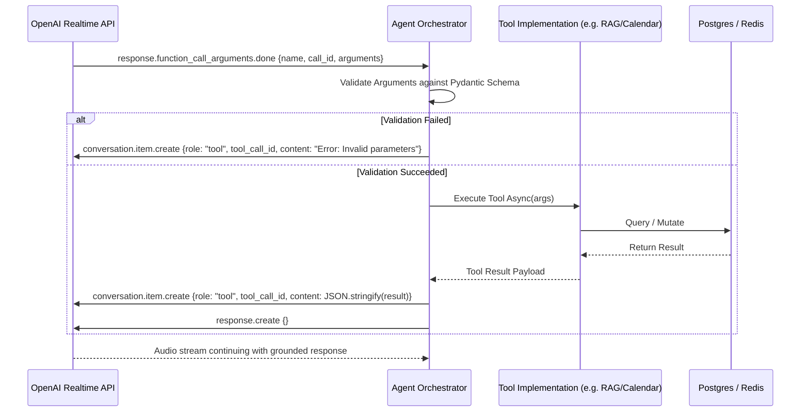

# CALLFLOW AI — Multi-Agent Architecture Specification

> **Platform Version:** 1.0.0-PROD-SPEC  
> **Architecture Pattern:** Real-Time Hybrid Orchestrator with Specialized Sub-Agents & Asynchronous Intelligence Extractors  
> **Core Model Engines:** OpenAI Realtime Multimodal Voice API (`gpt-4o-realtime-preview`) + Structured Extraction (`gpt-4o-mini`)

---

## 1. Multi-Agent Ecosystem Overview

CallFlow AI divides conversational voice automation into **8 specialized agent roles**. Rather than running monolithic LLM prompts that suffer from context bloat and hallucination, CallFlow AI decomposes the conversational lifecycle into tight, bounded runtime components coordinated by a central **Voice Orchestrator**.

```mermaid
flowchart TD
    subgraph LiveVoicePipeline [Real-Time Audio Session - Sub-500ms RTT]
        VAD[Voice Activity Detector\n(Server-Side VAD)] --> VoiceAgent[1. Voice Agent\nSession & Turn Controller]
        VoiceAgent <--> Orch[Agent Orchestrator & Tool Dispatcher]
        
        Orch <--> QualAgent[2. Qualification Agent\nBANT / MEDDIC Logic]
        Orch <--> RAGAgent[3. Knowledge / RAG Agent\nQdrant Hybrid Search]
        Orch <--> SchedAgent[4. Scheduling Agent\nCalendar Availability & Booking]
        Orch <--> CRMAgent[5. CRM Agent\nLead Sync & Stage Tracking]
        
        VoiceAgent -.-> SuperAgent[7. Supervisor Agent\nReal-Time Guardrails & Sentiment]
    end

    subgraph AsyncPostCallPipeline [Asynchronous Post-Call Intelligence Pipeline]
        CallEndedEvent[Call Terminated Event] --> PostCallAgent[8. Post-Call Analysis Agent\nStructured BANT & Summary]
        PostCallAgent --> CommAgent[6. Communication Agent\nSMS & Email Confirmations]
        PostCallAgent --> ExternalSync[n8n Workflow Engine\nCRM & Webhook Sync]
    end

    SuperAgent -.->|Trigger Escalation| WarmTransfer[Twilio Warm Transfer Engine]
```

---

## 2. Specialized Agent Specifications

### 2.1 Agent 1: Voice Agent (Session & Turn Controller)
- **Role:** High-speed real-time multimodal voice controller.
- **Engine:** OpenAI Realtime WebSocket API (`gpt-4o-realtime-preview`).
- **Primary Responsibilities:**
  1. Manages direct audio streaming with Twilio Media Stream over WebSockets.
  2. Implements Voice Activity Detection (VAD) with configurable prefix padding and silence threshold (default: 500ms).
  3. Executes instant barge-in / interruption handling: cancels model output generation and sends a `clear` command to Twilio's audio buffer immediately when user speech begins.
  4. Delivers mandatory **AI disclosure** at the onset of every call:  
     *"Hi there, this is Alex, an automated AI assistant calling on behalf of [Company Name]. Am I speaking with [Lead First Name]?"*
  5. Enforces conversational pacing, tone, and active listening acknowledgments ("*Understood*", "*Sure, let me check that for you*").

---

### 2.2 Agent 2: Qualification Agent (BANT / MEDDIC Logic)
- **Role:** Dynamic conversation progression and qualification state tracker.
- **Execution Mode:** Context injection & Tool Calling during active speech turns.
- **Qualification Framework:** **BANT** (Budget, Authority, Need, Timeline).
- **Interface & Tool Call:** `evaluate_lead_qualification`
- **Responsibilities:**
  - Identifies which BANT elements have been satisfied based on user responses.
  - Dynamically drives the next conversational objective without sounding like an interrogation script.
  - Detects explicit disqualifiers (e.g. competitor employee, no budget, invalid geographic territory) and triggers polite call wrap-up.

---

### 2.3 Agent 3: Knowledge / RAG Agent (Real-Time Retrieval)
- **Role:** Instantaneous grounding against verified company documents, pricing tiers, FAQs, and compliance policies.
- **Execution Engine:** Qdrant Hybrid Search (Dense Cosine Embeddings + Sparse Keyword Match).
- **Latency Budget:** Total retrieval and context formatting completed in **< 180ms**.
- **Interface / Tool Definition:**
```json
{
  "type": "function",
  "name": "search_knowledge_base",
  "description": "Searches the official company knowledge base for accurate facts regarding pricing, features, integrations, and policies.",
  "parameters": {
    "type": "object",
    "properties": {
      "query": {
        "type": "string",
        "description": "The specific semantic query to look up in the knowledge base."
      },
      "category": {
        "type": "string",
        "enum": ["pricing", "product_features", "technical_specs", "compliance", "general"],
        "description": "Optional category filter to restrict vector search domain."
      }
    },
    "required": ["query"]
  }
}
```
- **Grounding Rule:** If Qdrant returns a maximum similarity score below `0.65`, the agent is strictly prohibited from guessing. It responds:  
  *"I want to make sure I give you the exact details on that. Let me have our solutions specialist follow up with you on that specific point."*

---

### 2.4 Agent 4: Scheduling Agent (Calendar Availability & Booking)
- **Role:** Interactive calendar slot negotiation, conflict checking, and appointment reservation.
- **Integrations:** Google Calendar, Microsoft 365, Cal.com, internal Postgres slots.
- **Tool Definitions:**

#### Tool 1: `check_calendar_availability`
```json
{
  "type": "function",
  "name": "check_calendar_availability",
  "description": "Checks available appointment slots for a given date range and timezone.",
  "parameters": {
    "type": "object",
    "properties": {
      "preferred_date": {
        "type": "string",
        "description": "Target date in YYYY-MM-DD format."
      },
      "timezone": {
        "type": "string",
        "description": "The lead's local IANA timezone, e.g., 'America/New_York'."
      }
    },
    "required": ["preferred_date"]
  }
}
```

#### Tool 2: `book_appointment_slot`
```json
{
  "type": "function",
  "name": "book_appointment_slot",
  "description": "Reserves a confirmed calendar meeting slot for the lead.",
  "parameters": {
    "type": "object",
    "properties": {
      "start_time_iso": {
        "type": "string",
        "description": "Start timestamp in ISO 8601 format (e.g. '2026-10-08T14:00:00Z')."
      },
      "meeting_topic": {
        "type": "string",
        "description": "Brief agenda or title for the calendar invitation."
      },
      "attendee_notes": {
        "type": "string",
        "description": "Specific questions or requirements mentioned by the prospect."
      }
    },
    "required": ["start_time_iso"]
  }
}
```

---

### 2.5 Agent 5: CRM Agent (Contact Sync & Pipeline Updates)
- **Role:** Updates contact attributes, lead stage, and notes during or immediately following the call.
- **Tool Definition:** `update_crm_lead`
```json
{
  "type": "function",
  "name": "update_crm_lead",
  "description": "Updates customer relationship details in the database and connected CRM.",
  "parameters": {
    "type": "object",
    "properties": {
      "lead_stage": {
        "type": "string",
        "enum": ["contacted", "qualifying", "qualified", "unqualified", "demo_scheduled", "transferred", "do_not_call"]
      },
      "updated_fields": {
        "type": "object",
        "description": "Key-value map of validated properties (e.g. company_size, target_budget, existing_vendor)."
      }
    },
    "required": ["lead_stage"]
  }
}
```

---

### 2.6 Agent 6: Communication Agent (Follow-Up Automation)
- **Role:** Dispatches confirmation SMS, email calendar invites, and follow-up collateral.
- **Trigger:** Invoked post-call or mid-call if requested by caller (*"Can you text me that link?"*).
- **Tool Definition:** `send_followup_message`
```json
{
  "type": "function",
  "name": "send_followup_message",
  "description": "Sends an immediate SMS or Email to the lead with appointment confirmation or informational links.",
  "parameters": {
    "type": "object",
    "properties": {
      "channel": {
        "type": "string",
        "enum": ["sms", "email"]
      },
      "message_type": {
        "type": "string",
        "enum": ["appointment_confirmation", "product_brochure", "rep_contact_card"]
      },
      "custom_note": {
        "type": "string",
        "description": "Optional personalized message snippet."
      }
    },
    "required": ["channel", "message_type"]
  }
}
```

---

### 2.7 Agent 7: Supervisor Agent (Real-Time Safety & Escalation)
- **Role:** Continuous asynchronous oversight of the live conversational audio stream.
- **Monitoring Streams:** Evaluates incoming user transcript deltas every 2 seconds.
- **Escalation Triggers:**
  1. **Frustration / Negative Sentiment Spike:** Instantaneous sentiment score drops below `-0.6`.
  2. **Explicit Transfer Request:** Caller states "*I want to speak with a human*", "*Get me a manager*", or "*Transfer me*".
  3. **Dead Air / Silence Loop:** No user speech detected for > 15 seconds despite agent prompts.
  4. **Repetitive Disfluency:** Model repeats the same question or tool error 2 consecutive times.
- **Tool Definition:** `transfer_call_to_human`
```json
{
  "type": "function",
  "name": "transfer_call_to_human",
  "description": "Transfers the active live call to a designated human supervisor or call center hunt group.",
  "parameters": {
    "type": "object",
    "properties": {
      "escalation_reason": {
        "type": "string",
        "description": "Clear rationale for the handoff (e.g. 'caller requested human', 'complex pricing negotiation', 'sentiment degradation')."
      },
      "urgency_level": {
        "type": "string",
        "enum": ["normal", "urgent", "immediate_retention"]
      },
      "context_summary": {
        "type": "string",
        "description": "A 2-sentence briefing spoken to the receiving human agent before bridging the call."
      }
    },
    "required": ["escalation_reason", "context_summary"]
  }
}
```

---

### 2.8 Agent 8: Post-Call Analysis Agent (Intelligence Extraction)
- **Role:** Deep analytical review of complete conversation transcript.
- **Execution Mode:** Background job executed via worker immediately after call hang-up.
- **Model Engine:** `gpt-4o-mini` with JSON Structured Outputs schema.
- **Extraction Schema:**
```json
{
  "type": "object",
  "properties": {
    "executive_summary": { "type": "string" },
    "lead_score": {
      "type": "object",
      "properties": {
        "composite_score": { "type": "integer", "minimum": 0, "maximum": 100 },
        "budget_score": { "type": "integer", "minimum": 0, "maximum": 25 },
        "authority_score": { "type": "integer", "minimum": 0, "maximum": 25 },
        "need_score": { "type": "integer", "minimum": 0, "maximum": 25 },
        "timeline_score": { "type": "integer", "minimum": 0, "maximum": 25 },
        "rationale": { "type": "string" }
      },
      "required": ["composite_score", "budget_score", "authority_score", "need_score", "timeline_score", "rationale"]
    },
    "pain_points": { "type": "array", "items": { "type": "string" } },
    "objections_raised": { "type": "array", "items": { "type": "string" } },
    "sentiment_analysis": {
      "overall": { "type": "string", "enum": ["positive", "neutral", "negative", "frustrated"] },
      "sentiment_trajectory": { "type": "string", "enum": ["improved", "stable", "deteriorated"] }
    },
    "action_items": { "type": "array", "items": { "type": "string" } },
    "suggested_follow_up": { "type": "string" }
  },
  "required": ["executive_summary", "lead_score", "pain_points", "objections_raised", "sentiment_analysis", "action_items"]
}
```

---

## 3. Voice Persona & Prompt Engineering Standards

### 3.1 Base System Prompt Template
Every voice agent session is initialized with this foundational context:

```text
You are Alex, an expert sales development representative for {{organization_name}}.
You are speaking live over a phone call with {{lead_first_name}} {{lead_last_name}}.

CORE CONVERSATIONAL PRINCIPLES:
1. AI DISCLOSURE: In your very first sentence, you MUST state clearly that you are an AI assistant calling on behalf of {{organization_name}}.
2. SPOKEN BREVITY: You are on a phone call. Keep every response under 2 sentences unless explicitly asked for a detailed breakdown. Never recite bullet points or markdown tables.
3. NATURAL CADENCE: Speak with warmth, professional energy, and active listening cues.
4. ACCURACY OVER INVENTION: Use the 'search_knowledge_base' tool whenever a prospect asks about features, pricing, or technical specifications. Never guess or invent details.
5. OBJECTION HANDLING: Acknowledge objections calmly before responding. If a prospect is busy, offer to send a calendar link or schedule a quick 10-minute follow-up.
6. COMPLIANCE & CONSENT: If the prospect says "Stop calling me", "Remove my number", or asks not to be contacted, you must immediately apologize, invoke the 'update_crm_lead' tool with status 'do_not_call', confirm they have been removed, and politely end the call.
```

---

## 4. Tool Execution & Orchestration Engine


