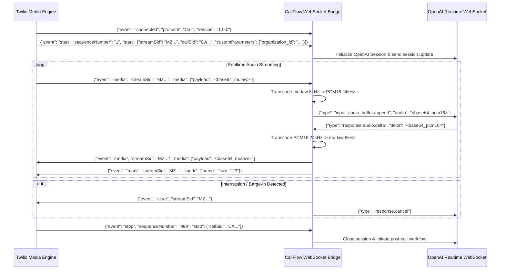

# CALLFLOW AI — API Design & Interface Specifications

> **Platform Version:** 1.0.0-PROD-SPEC  
> **Protocol Support:** RESTful HTTPS (JSON) + Bidirectional WebSockets (WSS)  
> **API Version:** v1 (`/api/v1`)  
> **Standard Response Format:** RFC 7807 Problem Details compliant for errors, typed envelopes for data.

---

## 1. Global Conventions & Standards

### 1.1 Standard Response Envelopes

#### Success Envelope (`2xx`)
```json
{
  "success": true,
  "data": { ... },
  "meta": {
    "request_id": "req_01HX98ZQK7E9P2Q8Z87Y3D",
    "timestamp": "2026-10-05T12:00:00Z",
    "pagination": {
      "page": 1,
      "limit": 25,
      "total_items": 142,
      "total_pages": 6
    }
  }
}
```

#### Error Envelope (`4xx`, `5xx`)
```json
{
  "success": false,
  "error": {
    "code": "RESOURCE_NOT_FOUND",
    "message": "Lead with id '8a9c7b64-...' was not found in your organization.",
    "details": [
      {
        "field": "lead_id",
        "issue": "Invalid UUID or unauthorized access"
      }
    ],
    "request_id": "req_01HX98ZQK7E9P2Q8Z87Y3D"
  }
}
```

### 1.2 Authentication Headers
- **User / Operator Sessions:** `Authorization: Bearer <JWT_ACCESS_TOKEN>`
- **Machine-to-Machine / Integrations:** `X-API-Key: cfk_live_************************`
- **Twilio Webhooks:** Validated via HMAC-SHA1 using `X-Twilio-Signature` and Twilio Auth Token.

---

## 2. RESTful API Routes

### 2.1 Authentication & Profile (`/api/v1/auth`)

| Method | Endpoint | Description | Auth Required |
|---|---|---|---|
| `POST` | `/api/v1/auth/login` | Authenticate with email/password, returns JWT pair. | None |
| `POST` | `/api/v1/auth/refresh` | Exchange refresh token for new access token. | None (Refresh Bearer) |
| `POST` | `/api/v1/auth/logout` | Revoke active refresh token in Redis. | Bearer |
| `GET` | `/api/v1/auth/me` | Fetch authenticated user profile, permissions, and org metadata. | Bearer |
| `POST` | `/api/v1/auth/mfa/verify` | Verify TOTP MFA code during stepped-up login. | Temporary MFA Token |

---

### 2.2 Organizations & Roles (`/api/v1/organizations`)

| Method | Endpoint | Description | Permissions |
|---|---|---|---|
| `GET` | `/api/v1/organizations/current` | Retrieve organization settings, telephony credentials, quotas. | `org:read` |
| `PATCH` | `/api/v1/organizations/current` | Update organization settings (default voice, twilio config). | `org:admin` |
| `GET` | `/api/v1/organizations/roles` | List defined RBAC roles and permissions. | `roles:read` |
| `POST` | `/api/v1/organizations/users/invite` | Invite a new user (sales rep, supervisor) to the organization. | `users:invite` |

---

### 2.3 Leads Management (`/api/v1/leads`)

| Method | Endpoint | Description | Permissions |
|---|---|---|---|
| `GET` | `/api/v1/leads` | Paginated filterable lead listing (by status, score, rep). | `leads:read` |
| `POST` | `/api/v1/leads` | Create a single lead record. | `leads:write` |
| `POST` | `/api/v1/leads/import-csv` | Bulk upload CSV leads with mapping validation. | `leads:write` |
| `GET` | `/api/v1/leads/{lead_id}` | Fetch full lead dossier, call history, and qualification scores. | `leads:read` |
| `PATCH` | `/api/v1/leads/{lead_id}` | Update lead fields, status, or assigned sales rep. | `leads:write` |
| `POST` | `/api/v1/leads/{lead_id}/call-now` | Trigger immediate on-demand outbound AI call to this lead. | `calls:initiate` |
| `POST` | `/api/v1/leads/{lead_id}/opt-out` | Mark lead as DNC (Do Not Call) immediately. | `leads:write` |

#### Sample Request: `POST /api/v1/leads/{lead_id}/call-now`
```json
{
  "campaign_id": "4e76a6b5-3142-4fcf-b673-a602a9eb786a",
  "priority": "high",
  "override_prompt_context": {
    "promo_code": "AUTUMN2026",
    "referrer": "Inbound Webinar"
  }
}
```

---

### 2.4 Campaigns Orchestration (`/api/v1/campaigns`)

| Method | Endpoint | Description | Permissions |
|---|---|---|---|
| `GET` | `/api/v1/campaigns` | List active, scheduled, and completed outbound campaigns. | `campaigns:read` |
| `POST` | `/api/v1/campaigns` | Create a new campaign with calling rules, pacing, and prompt. | `campaigns:write` |
| `GET` | `/api/v1/campaigns/{campaign_id}` | Get campaign details, lead progress, and live metrics. | `campaigns:read` |
| `PATCH` | `/api/v1/campaigns/{campaign_id}` | Update campaign prompt, calling hours, or concurrency limit. | `campaigns:write` |
| `POST` | `/api/v1/campaigns/{campaign_id}/start` | Launch campaign dialer loop. | `campaigns:execute` |
| `POST` | `/api/v1/campaigns/{campaign_id}/pause` | Pause active campaign dialer immediately. | `campaigns:execute` |
| `POST` | `/api/v1/campaigns/{campaign_id}/leads` | Assign lead batch to campaign. | `campaigns:write` |

---

### 2.5 Calls & Intelligence (`/api/v1/calls`)

| Method | Endpoint | Description | Permissions |
|---|---|---|---|
| `GET` | `/api/v1/calls` | Filter call records (by date, direction, duration, status). | `calls:read` |
| `GET` | `/api/v1/calls/{call_id}` | Complete call record with telemetry, metrics, and timestamps. | `calls:read` |
| `GET` | `/api/v1/calls/{call_id}/transcript` | Full turn-by-turn transcript with speaker diarization. | `calls:read` |
| `GET` | `/api/v1/calls/{call_id}/summary` | AI-generated summary, sentiment, pain points, objections. | `calls:read` |
| `GET` | `/api/v1/calls/{call_id}/recording` | Pre-signed URL to S3 audio recording file. | `calls:listen` |
| `POST` | `/api/v1/calls/{call_id}/terminate` | Force-terminate an active call. | `calls:terminate` |

#### Sample Response: `GET /api/v1/calls/{call_id}/summary`
```json
{
  "success": true,
  "data": {
    "call_id": "f51f4964-13bb-4015-8f43-a6de25102f9e",
    "executive_summary": "Prospect Jane Doe called regarding enterprise voice automation. Budget is approved for Q4 ($60k), authority confirmed as VP of Sales. Scheduled demo for Thursday 2pm.",
    "qualification_status": "qualified",
    "sentiment_overall": "positive",
    "composite_score": 92,
    "breakdown": {
      "budget": 24,
      "authority": 25,
      "need": 23,
      "timeline": 20
    },
    "pain_points": [
      "Current SDRs spend 70% of time dialing voicemails",
      "Lead response time averages 4 hours"
    ],
    "objections_raised": [
      "Concerned about AI latency sounding robotic"
    ],
    "action_items": [
      "Prepare customized latency demo for VP of Sales",
      "Send calendar invite for Oct 8 at 2:00 PM EST"
    ],
    "recommended_follow_up": "Send high-level technical whitepaper on WebSockets architecture prior to demo."
  }
}
```

---

### 2.6 Appointments & Calendaring (`/api/v1/appointments`)

| Method | Endpoint | Description | Permissions |
|---|---|---|---|
| `GET` | `/api/v1/appointments` | List scheduled meetings, attendees, and statuses. | `appointments:read` |
| `POST` | `/api/v1/appointments` | Manually book or update an appointment slot. | `appointments:write` |
| `GET` | `/api/v1/appointments/availability` | Query available calendar slots for an agent or team. | `appointments:read` |
| `POST` | `/api/v1/appointments/{id}/cancel` | Cancel an appointment and trigger notification webhook. | `appointments:write` |

---

### 2.7 Knowledge Base & Vector Indexing (`/api/v1/knowledge`)

| Method | Endpoint | Description | Permissions |
|---|---|---|---|
| `GET` | `/api/v1/knowledge/documents` | List uploaded documents, version, status, and chunk count. | `kb:read` |
| `POST` | `/api/v1/knowledge/documents/upload` | Multipart form upload (PDF, DOCX, TXT) for chunking & vectorization. | `kb:write` |
| `DELETE` | `/api/v1/knowledge/documents/{id}` | Purge document and delete corresponding Qdrant vector points. | `kb:write` |
| `POST` | `/api/v1/knowledge/search-preview` | Test vector search endpoint returning matched chunks & scores. | `kb:read` |

---

### 2.8 Telephony Webhooks (`/api/v1/telephony`)
*All endpoints validate `X-Twilio-Signature`.*

| Method | Endpoint | Description | Provider |
|---|---|---|---|
| `POST` | `/api/v1/telephony/inbound` | Inbound voice webhook. Returns TwiML with `<Connect><Stream>` pointing to WebSocket bridge. | Twilio Voice |
| `POST` | `/api/v1/telephony/status-callback` | Receives call state changes (`ringing`, `in-progress`, `completed`). | Twilio Voice |
| `POST` | `/api/v1/telephony/recording-callback` | Receives Twilio PSTN recording URL if carrier-side recording is enabled. | Twilio Voice |
| `POST` | `/api/v1/telephony/transfer-fallback` | Fallback TwiML if warm transfer to human agent fails or times out. | Twilio Voice |

#### Sample TwiML Response: `POST /api/v1/telephony/inbound`
```xml
<?xml version="1.0" encoding="UTF-8"?>
<Response>
    <Connect>
        <Stream url="wss://api.callflow.ai/ws/media-stream">
            <Parameter name="organization_id" value="8a9c7b64-320d-407a-9a99-f2e1a221a998"/>
            <Parameter name="direction" value="inbound"/>
        </Stream>
    </Connect>
</Response>
```

---

### 2.9 Real-Time Escalation & Supervisor API (`/api/v1/escalations`)

| Method | Endpoint | Description | Permissions |
|---|---|---|---|
| `GET` | `/api/v1/escalations/active` | List calls flagged by AI supervisor requiring human intervention. | `supervisor:read` |
| `POST` | `/api/v1/escalations/{call_id}/takeover` | Force Twilio bridge transition from AI agent to human agent. | `supervisor:act` |
| `POST` | `/api/v1/escalations/{call_id}/whisper` | Inject supervisor text-to-speech prompt or guidance into live context. | `supervisor:act` |

---

### 2.10 Analytics & Dashboards (`/api/v1/analytics`)

| Method | Endpoint | Description | Permissions |
|---|---|---|---|
| `GET` | `/api/v1/analytics/overview` | Aggregated KPIs: call volume, answer rate, qualification %, cost. | `analytics:read` |
| `GET` | `/api/v1/analytics/conversion-funnel`| Funnel analysis: Ingested -> Dialed -> Connected -> Qualified -> Booked. | `analytics:read` |
| `GET` | `/api/v1/analytics/sentiment-trends` | Time-series sentiment breakdown across calls. | `analytics:read` |

---

## 3. WebSocket Specifications

### 3.1 Telephony Media Stream Bridge
- **Endpoint:** `wss://api.callflow.ai/ws/media-stream`
- **Protocol:** Twilio Bi-Directional Media Stream Protocol (G.711 mu-law, 8kHz, base64 payload).

#### Sequence of Twilio Stream Events:



---

### 3.2 Live Operations & Dashboard Stream
- **Endpoint:** `wss://api.callflow.ai/ws/live-dashboard/{organization_id}`
- **Authentication:** `Sec-WebSocket-Protocol: Bearer, <JWT>` or ticket query parameter.
- **Event Types Emitted to Frontend:**
  1. `call.started`: Active call initiated with lead details.
  2. `call.transcript_delta`: Stream of incoming words/tokens with speaker role (`user` / `assistant`).
  3. `call.tool_invoked`: Notification that agent is searching KB or checking calendar.
  4. `call.sentiment_update`: Instantaneous sentiment score (-1.0 to +1.0).
  5. `call.escalation_flagged`: High-priority alert requiring supervisor attention.
  6. `call.ended`: Final duration, outcome, and link to summary.

---

### 3.3 Supervisor Audio & Whisper Stream
- **Endpoint:** `wss://api.callflow.ai/ws/supervisor/{call_id}`
- **Permissions Required:** `supervisor:listen` / `supervisor:act`
- **Capabilities:**
  - Streams low-latency decoded PCM16/Opus audio to supervisor browser for silent listening.
  - Receives supervisor microphone audio when "Whisper" mode is toggled to coach the agent or takeover.
