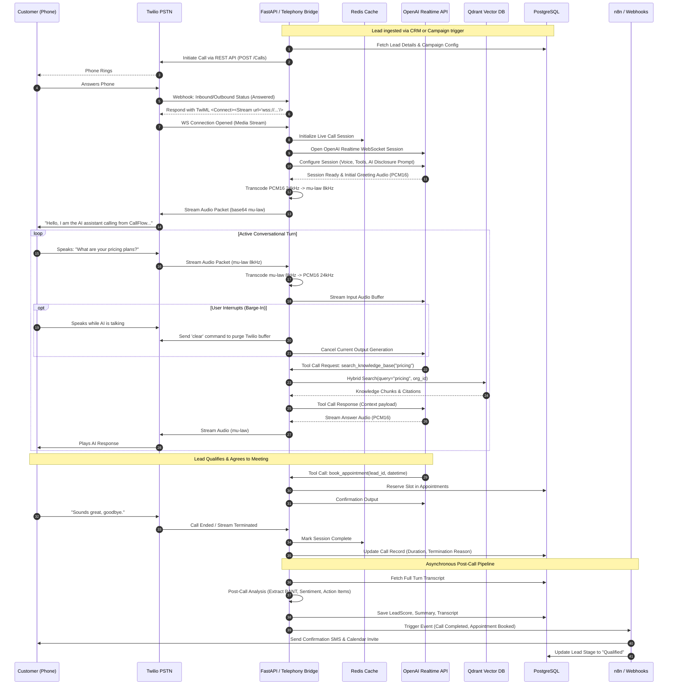
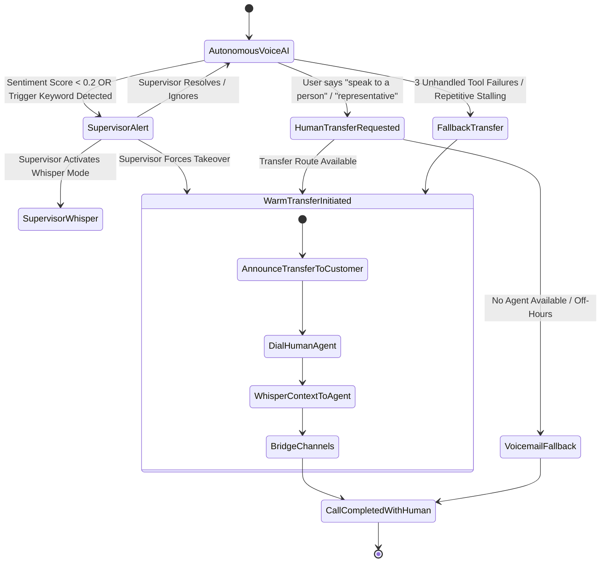

# CALLFLOW AI — Architecture Blueprint

> **Tagline:** "AI Voice Agents That Actually Get Work Done."  
> **Platform Version:** 1.0.0-PROD-SPEC  
> **Status:** Architecture Design Document  
> **Primary Use Case:** AI Lead Qualification & Appointment Calling Agent

---

## 1. System Overview

CallFlow AI is a high-performance, event-driven, production-grade voice automation platform. It bridges telephony networks (PSTN/WebRTC via Twilio) with ultra-low latency real-time AI speech models (OpenAI Realtime Voice API), semantic knowledge retrieval (Qdrant), transactional data systems (PostgreSQL, Redis), and workflow automation engines (n8n).

Unlike conventional batch-oriented voice bots (which chain separate ASR -> LLM -> TTS pipelines with 1500–3000ms latency), CallFlow AI utilizes **bidirectional WebSocket streaming** directly with native multimodal voice models. This achieves sub-500ms conversational turn-around latency, supports human barge-in/interruption, and enables reliable agentic tool execution during active phone calls.

```mermaid
flowchart TB
    subgraph Telephony [Telephony Layer - Twilio]
        PSTN[PSTN / Customer Phone]
        TwilioVoice[Twilio Voice Engine]
        MediaStream[Twilio Bidirectional Media Stream\n(WebSocket: mu-law 8kHz)]
    end

    subgraph Edge [Edge / Ingress]
        Traefik[Reverse Proxy / TLS Termination / Load Balancer]
    end

    subgraph BackendApp [Backend Cluster - FastAPI & Async Engine]
        FastAPI[FastAPI Gateway\nREST & Webhook APIs]
        WSMediaHandler[WebSocket Telephony Bridge\n(Twilio <-> OpenAI Protocol)]
        AudioTranscoder[Audio Transcoder\n(mu-law 8kHz <-> PCM16 24kHz)]
        JitterBuffer[Dynamic Jitter & Interruption Buffer]
        AgentOrchestrator[Agent Runtime & Tool Dispatcher]
        SupervisorEngine[Real-Time Call Supervisor\n(Sentiment, Silence, Guardrails)]
    end

    subgraph AIPlatform [AI & Speech Infrastructure]
        OpenAIRealtime[OpenAI Realtime API\n(WebSocket Speech-to-Speech)]
        OpenAIEmbeddings[OpenAI Embeddings API\n(text-embedding-3-small)]
        PostCallLLM[Post-Call Analysis Engine\n(GPT-4o Mini / GPT-4o)]
    end

    subgraph StorageData [Data & State Tier]
        Postgres[(PostgreSQL 16\nACID, Auditing, Multi-Tenant)]
        RedisCache[(Redis 7.2 Cluster\nPubSub, Session Cache, Rate Limits)]
        Qdrant[(Qdrant Vector DB\nRAG Knowledge Base)]
        S3Storage[(S3 Compatible Storage\nRecordings, Transcripts, Artifacts)]
    end

    subgraph AutomationTier [Workflow & CRM Integration]
        N8nEngine[n8n Workflow Automation Engine]
        ExtCRM[External CRMs\n(HubSpot, Salesforce, Pipedrive)]
        CommsGate[SMS / Email Services\n(Twilio SMS, SendGrid)]
    end

    subgraph FrontendApp [User Interface - Next.js]
        Dashboard[Next.js 15 App Router\nTailwind CSS + shadcn/ui]
        LiveCallConsole[Live Call Monitor & Audio Stream]
        SupervisorHandoff[Human Takeover / Whisper Console]
    end

    %% Connections
    PSTN <--> TwilioVoice
    TwilioVoice <--> MediaStream
    MediaStream <--> Traefik
    Traefik <--> WSMediaHandler
    
    WSMediaHandler <--> AudioTranscoder
    AudioTranscoder <--> JitterBuffer
    JitterBuffer <--> OpenAIRealtime

    WSMediaHandler --> AgentOrchestrator
    AgentOrchestrator <--> OpenAIRealtime
    AgentOrchestrator <--> Qdrant
    AgentOrchestrator <--> RedisCache
    AgentOrchestrator --> Postgres
    
    SupervisorEngine <--> WSMediaHandler
    SupervisorEngine --> RedisCache
    
    FastAPI --> Postgres
    FastAPI --> RedisCache
    
    WSMediaHandler --> S3Storage
    PostCallLLM --> S3Storage
    PostCallLLM --> Postgres
    
    AgentOrchestrator --> N8nEngine
    N8nEngine --> ExtCRM
    N8nEngine --> CommsGate

    Dashboard <--> FastAPI
    Dashboard <--> RedisCache
    SupervisorHandoff <--> WSMediaHandler
```

---

## 2. End-to-End Call Lifecycle

### 2.1 Outbound Lead Qualification Lifecycle



---

## 3. Subsystem Responsibilities

### 3.1 Frontend (`frontend/`)
- **Technology Stack:** Next.js (App Router), TypeScript, Tailwind CSS, shadcn/ui, TanStack Query, Zustand, Socket.io-client / Native WebSockets, Recharts.
- **Core Responsibilities:**
  - **Live Operations Dashboard:** Displays active calls, channel states, instantaneous sentiment, and agent activity.
  - **Live Audio & Call Monitor:** Real-time audio playback through browser AudioContext, streaming live transcripts with speaker diarization.
  - **Supervisor Console:** One-click live takeover, agent whispering, and manual call termination.
  - **Campaign Management:** Interface for configuring calling cadences, uploading CSV lead lists, setting operating hours, and managing retry rules.
  - **Knowledge Base Manager:** Drag-and-drop document upload (PDF, DOCX, TXT), chunking preview, embedding status, and search testing playground.
  - **Lead & Customer View:** Full customer timeline, lead scores, historical transcripts, audio playback, and appointment status.
  - **Analytics & Reporting:** Visualizations of conversion rates, call drop-off points, BANT qualification metrics, and cost per qualified lead.
  - **Role-Based Access Control UI:** Dedicated views and permission fences for SuperAdmin, OrgAdmin, Supervisor, and SalesRep.

### 3.2 Backend (`backend/`)
- **Technology Stack:** Python 3.11+, FastAPI, Uvicorn, Asyncio, Pydantic v2, SQLAlchemy 2.0 (Async), Alembic, WebSockets.
- **Core Responsibilities:**
  - **REST API Gateway:** Authentication, organization management, campaign orchestration, lead ingestion, appointment booking, knowledge indexing, and analytics queries.
  - **Telephony Webhook Router:** Handles Twilio signature verification, dynamic TwiML generation, call status updates, recording callbacks, and fallback routing.
  - **Bi-Directional Media Stream Bridge:**
    - High-throughput asynchronous WebSocket server accepting raw Twilio media streams.
    - Low-latency bi-directional bridging to OpenAI Realtime API.
    - Jitter buffering, packet loss compensation, and audio framing.
  - **Audio Transcoding Engine:** Highly optimized in-memory translation between Twilio's G.711 mu-law (8kHz, 8-bit mono) and OpenAI's PCM16 (24kHz, 16-bit little-endian mono).
  - **Real-Time Agentic Tool Dispatcher:** Intercepts LLM tool invocations, executes local validations, interfaces with DB/Qdrant/External APIs, and injects results back into the model context in under 150ms.
  - **Call Supervisor Engine:** Background listener analyzing live transcripts for escalation triggers (profanity, distress, customer explicit handoff requests, repetitive loops) and orchestrating human transfer.
  - **Background Worker & Task Queue:** Celery / ARQ worker processing audio storage upload, embedding generation, post-call analysis, and webhook dispatches.

### 3.3 Database Tier (`PostgreSQL`)
- **Technology Stack:** PostgreSQL 16 with UUIDv7 extensions and pg_stat_statements.
- **Core Responsibilities:**
  - Source of truth for all multi-tenant entity data, campaigns, leads, calls, transcripts, summaries, and appointments.
  - Enforces tenant isolation via strict foreign key relationships and Row-Level Security (RLS) policies.
  - Provides immutable audit trails for every agent action, user change, and tool invocation.
  - Houses structured metadata and relational mappings for vector embeddings stored in Qdrant.

### 3.4 In-Memory & Real-Time State (`Redis`)
- **Technology Stack:** Redis 7.2.
- **Core Responsibilities:**
  - **Active Session State:** Ephemeral tracking of live call parameters, active tool state, and audio sequence counters.
  - **Pub/Sub Backbone:** Distributes live transcript chunks and supervisor events to connected dashboard frontends.
  - **Distributed Locks:** Prevents double-calling leads and race conditions during simultaneous slot bookings.
  - **Rate Limiting & Token Buckets:** Protects APIs and outbound calling queues from exceeding carrier/LLM rate caps.

### 3.5 AI & Real-Time Voice Layer (`OpenAI`)
- **Technology Stack:** OpenAI Realtime API (`gpt-4o-realtime-preview`), Embeddings (`text-embedding-3-small`), Structured Extraction (`gpt-4o-mini`).
- **Core Responsibilities:**
  - **Realtime Voice Model:** End-to-end native speech-to-speech processing with natural intonation, dynamic prosody, and native turn detection.
  - **Tool Calling:** Emits structured function calls with schema validation during live speech turns.
  - **Vector Embeddings:** Generates 1536-dimensional dense embeddings for knowledge document chunks.
  - **Post-Call Structured Extraction:** Analyzes full transcript to compute BANT criteria, objection taxonomy, sentiment trajectory, and executive summaries.

### 3.6 Retrieval-Augmented Generation (`Qdrant`)
- **Technology Stack:** Qdrant Vector Database (Distributed or Standalone Container).
- **Core Responsibilities:**
  - Stores vector embeddings for company knowledge bases, FAQ libraries, product catalogs, and compliance constraints.
  - Performs multi-tenant filtered vector search scoped strictly by `organization_id`.
  - Supports hybrid retrieval (dense vectors + sparse BM25 payload match) with sub-50ms query latency to meet live conversational voice deadlines.

### 3.7 Telephony & Media Layer (`Twilio`)
- **Technology Stack:** Twilio Programmable Voice, Twilio Media Streams, Twilio REST API.
- **Core Responsibilities:**
  - Inbound phone number hosting and PSTN routing.
  - Outbound call initiation and carrier trunking.
  - Bidirectional audio streaming over WebSockets using mu-law 8kHz format.
  - Cold and warm call transfers to human call centers via SIP or PSTN `<Dial>`.
  - Telephony status callbacks (initiated, ringing, answered, completed, busy, no-answer).

### 3.8 Workflow Automation (`n8n`)
- **Technology Stack:** n8n Workflow Automation Platform (Self-Hosted via Docker).
- **Core Responsibilities:**
  - Low-code orchestration connecting CallFlow AI events to external ecosystems (HubSpot, Salesforce, Zoho, Google Sheets, Slack, SendGrid).
  - Out-of-the-box templates for post-call lead syncing, appointment confirmation workflows, and notification dispatching.
  - Decouples core backend service from specific 3rd-party SaaS API churn.

---

## 4. Audio Streaming & Transcoding Pipeline

Voice streaming requires sub-100ms packet processing to avoid conversational latency degradation.

```mermaid
flowchart LR
    subgraph TwilioInbound [Twilio -> CallFlow]
        T_Audio[mu-law 8kHz Audio Frames\n20ms payload = 160 bytes] --> Base64Dec[Base64 Decode]
        Base64Dec --> MuLawToLinear[G.711 mu-law to Linear PCM16]
        MuLawToLinear --> ResampleUp[Resample 8kHz to 24kHz\n(Polyphase FIR / Linear)]
        ResampleUp --> OAI_InBuf[OpenAI input_audio_buffer.append]
    end

    subgraph OpenAIOutbound [CallFlow -> Twilio]
        OAI_Out[OpenAI response.audio.delta\nPCM16 24kHz] --> ResampleDown[Resample 24kHz to 8kHz]
        ResampleDown --> LinearToMuLaw[Linear PCM16 to G.711 mu-law]
        LinearToMuLaw --> Base64Enc[Base64 Encode]
        Base64Enc --> T_OutMsg[Twilio Media Event\n20ms / 160-byte chunks]
    end
```

### 4.1 Latency Budget Matrix
To maintain natural human conversation, total round-trip latency must stay below **600ms**.

| Pipeline Stage | Latency Target | Optimization Strategy |
|---|---|---|
| Twilio Ingress & Audio Packetization | 20ms – 40ms | Standard 20ms G.711 frame packets |
| Network Ingress to FastAPI Bridge | 15ms – 30ms | Direct edge proxy, co-located AWS/GCP region |
| Audio Transcoding (mu-law <-> PCM16) | 1ms – 3ms | Pure C-extension / SIMD NumPy resampler in memory |
| OpenAI Realtime Speech Processing | 250ms – 350ms | Server-side VAD, streaming audio tokens directly |
| RAG Tool Retrieval (when triggered) | 120ms – 180ms | In-memory Qdrant HNSW index + Redis query cache |
| Transcoding & Twilio Egress | 15ms – 25ms | Chunked streaming backpressure buffer |
| Twilio PSTN Delivery | 40ms – 60ms | Carrier routing |
| **Total Round-Trip Time (RTT)** | **461ms – 688ms** | **Perceived as immediate, natural human cadence** |

---

## 5. Human Escalation & Supervisor Architecture

CallFlow AI enforces safety and customer satisfaction through a multi-tier human escalation pipeline.



### Escalation Modes:
1. **Live Whisper (Coaching Mode):** A human supervisor listens in via the web dashboard. The supervisor can speak into their microphone; audio is injected exclusively into the AI context buffer or an audio channel audible *only* to a junior human agent, without the customer hearing.
2. **Warm Transfer (SIP/PSTN `<Dial>`):** When the AI decides to transfer, it issues a `transfer_call_to_human` tool call. The backend:
   - Plays a courteous hold/transfer prompt to the caller.
   - Places the customer on hold with Comfort Noise Generation (CNG) or hold music.
   - Dials the assigned human agent or call center hunt group via Twilio.
   - When the agent picks up, speaks an automated AI briefing ("*Incoming transfer for Jane Doe, looking for Enterprise Plan, qualified budget $50k*").
   - Bridges the customer and agent together, releasing the AI voice channel.
3. **Graceful Fallback:** If human transfer fails or lines are busy, the agent apologizes, confirms the best callback number and time, records a priority task, and schedules a high-urgency CRM notification.

---

## 6. Observability, Logging & Tracing

1. **Distributed Tracing (OpenTelemetry):**
   - Every inbound/outbound call receives a global `correlation_id` propagated across Twilio webhooks, WebSocket media streams, Redis state, tool execution, and OpenAI request headers.
2. **Structured Logging (JSON format):**
   - Implemented via `structlog`.
   - Never logs raw PII (phone numbers, full names, emails) in plain text; automatically masks sensitive identifiers (`+1-***-***-1234`).
3. **Metrics (Prometheus & Grafana):**
   - Real-time gauges: Active concurrent calls, Twilio WebSocket connection count, OpenAI WebSocket connection count.
   - Histograms: Audio transcoding latency, RAG query latency, tool execution latency, turn-around latency.
   - Counters: Total calls placed/received, qualification conversions, appointment bookings, human handoffs, tool failures.
4. **Error Tracking (Sentry):**
   - Integrated into FastAPI middleware and async background workers with automated stack trace capture and context tagging (`call_sid`, `org_id`).

---

## 7. Multi-Tenancy & Data Isolation Model

CallFlow AI uses a **Logical Multi-Tenancy Architecture** with tenant scoping at the database and application levels:
- Every database entity contains an immutable `organization_id` foreign key.
- All database queries executed through SQLAlchemy sessions require an explicit tenant filter injected by tenant context middleware.
- Qdrant vector collections utilize payload-based partition filtering (`filter: { must: [ { key: "org_id", match: { value: org_id } } ] }`).
- Twilio phone numbers and subaccounts are mapped directly to specific organizations in the database.
- S3 object paths are prefixed with `s3://callflow-storage/{organization_id}/recordings/{call_id}.wav`.
- Redis keys are partitioned using the namespace `org:{organization_id}:call:{call_id}`.
