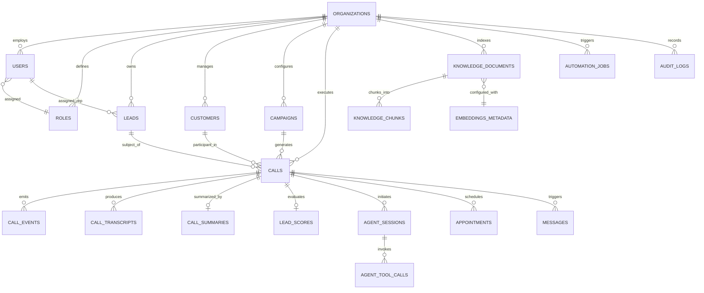

# CALLFLOW AI — Database Design & Schema Specification

> **Platform Version:** 1.0.0-PROD-SPEC  
> **Database Engine:** PostgreSQL 16+ with `uuid-ossp` or native UUIDv7 support  
> **Caching / Key-Value Store:** Redis 7.2  
> **Vector Database:** Qdrant (Hybrid Dense/Sparse)

---

## 1. Relational Schema Architecture (PostgreSQL)

CallFlow AI enforces strict multi-tenant isolation, referential integrity, and high-performance querying across high-concurrency telephony workloads. Every tenant-scoped entity links to `organizations(id)`. High-throughput append-only tables (`call_events`, `call_transcripts`, `audit_logs`) are optimized for range scanning and time-series partitioning.

### 1.1 Entity-Relationship (ER) Diagram



---

## 2. Table Specifications & DDL Definitions

### 2.1 Core Identity & Multi-Tenancy

#### `organizations`
Multi-tenant root container storing tenant settings, billing tier, and integration credentials.
```sql
CREATE TABLE organizations (
    id UUID PRIMARY KEY DEFAULT gen_random_uuid(),
    name VARCHAR(255) NOT NULL,
    slug VARCHAR(100) UNIQUE NOT NULL,
    status VARCHAR(50) DEFAULT 'active' CHECK (status IN ('active', 'suspended', 'trial', 'cancelled')),
    
    -- Telephony & Provider Configuration
    twilio_account_sid VARCHAR(255),
    twilio_auth_token_encrypted TEXT,
    twilio_phone_number VARCHAR(50),
    
    -- LLM & Voice Configuration
    openai_api_key_encrypted TEXT,
    default_voice_id VARCHAR(50) DEFAULT 'alloy',
    default_language VARCHAR(10) DEFAULT 'en-US',
    
    -- Limits & Quotas
    max_concurrent_calls INTEGER DEFAULT 5,
    monthly_call_minutes_limit INTEGER DEFAULT 1000,
    current_month_minutes_used INTEGER DEFAULT 0,
    
    created_at TIMESTAMPTZ DEFAULT CURRENT_TIMESTAMP NOT NULL,
    updated_at TIMESTAMPTZ DEFAULT CURRENT_TIMESTAMP NOT NULL
);

CREATE INDEX idx_organizations_slug ON organizations(slug);
CREATE INDEX idx_organizations_status ON organizations(status);
```

#### `roles`
Role definitions and permission bitmasks/JSON sets for RBAC.
```sql
CREATE TABLE roles (
    id UUID PRIMARY KEY DEFAULT gen_random_uuid(),
    organization_id UUID REFERENCES organizations(id) ON DELETE CASCADE,
    name VARCHAR(50) NOT NULL,
    description TEXT,
    permissions JSONB NOT NULL DEFAULT '[]'::jsonb,
    is_system_role BOOLEAN DEFAULT FALSE,
    created_at TIMESTAMPTZ DEFAULT CURRENT_TIMESTAMP NOT NULL,
    updated_at TIMESTAMPTZ DEFAULT CURRENT_TIMESTAMP NOT NULL,
    UNIQUE (organization_id, name)
);

CREATE INDEX idx_roles_org ON roles(organization_id);
```

#### `users`
Authenticated operators, sales representatives, and administrators.
```sql
CREATE TABLE users (
    id UUID PRIMARY KEY DEFAULT gen_random_uuid(),
    organization_id UUID NOT NULL REFERENCES organizations(id) ON DELETE CASCADE,
    role_id UUID NOT NULL REFERENCES roles(id) ON DELETE RESTRICT,
    email VARCHAR(255) UNIQUE NOT NULL,
    password_hash VARCHAR(255) NOT NULL,
    first_name VARCHAR(100) NOT NULL,
    last_name VARCHAR(100) NOT NULL,
    phone_number VARCHAR(50),
    status VARCHAR(50) DEFAULT 'active' CHECK (status IN ('active', 'invited', 'deactivated')),
    last_login_at TIMESTAMPTZ,
    created_at TIMESTAMPTZ DEFAULT CURRENT_TIMESTAMP NOT NULL,
    updated_at TIMESTAMPTZ DEFAULT CURRENT_TIMESTAMP NOT NULL
);

CREATE INDEX idx_users_org ON users(organization_id);
CREATE INDEX idx_users_email ON users(email);
```

---

### 2.2 CRM, Leads & Campaigns

#### `leads`
Target prospects for inbound/outbound voice automation.
```sql
CREATE TABLE leads (
    id UUID PRIMARY KEY DEFAULT gen_random_uuid(),
    organization_id UUID NOT NULL REFERENCES organizations(id) ON DELETE CASCADE,
    assigned_user_id UUID REFERENCES users(id) ON DELETE SET NULL,
    
    first_name VARCHAR(100),
    last_name VARCHAR(100),
    email VARCHAR(255),
    phone_number VARCHAR(50) NOT NULL,
    company_name VARCHAR(255),
    job_title VARCHAR(150),
    
    -- Qualification & Status
    status VARCHAR(50) DEFAULT 'new' CHECK (status IN ('new', 'contacted', 'qualifying', 'qualified', 'unqualified', 'appointment_scheduled', 'transferred', 'dnc')),
    lead_source VARCHAR(100) DEFAULT 'inbound_web',
    timezone VARCHAR(50) DEFAULT 'UTC',
    
    -- Custom Attributes & Enrichment
    custom_fields JSONB DEFAULT '{}'::jsonb,
    last_called_at TIMESTAMPTZ,
    call_attempts INTEGER DEFAULT 0,
    
    created_at TIMESTAMPTZ DEFAULT CURRENT_TIMESTAMP NOT NULL,
    updated_at TIMESTAMPTZ DEFAULT CURRENT_TIMESTAMP NOT NULL,
    UNIQUE (organization_id, phone_number)
);

CREATE INDEX idx_leads_org_phone ON leads(organization_id, phone_number);
CREATE INDEX idx_leads_status ON leads(organization_id, status);
CREATE INDEX idx_leads_assigned ON leads(assigned_user_id);
```

#### `customers`
Leads that have officially converted into active accounts or clients.
```sql
CREATE TABLE customers (
    id UUID PRIMARY KEY DEFAULT gen_random_uuid(),
    organization_id UUID NOT NULL REFERENCES organizations(id) ON DELETE CASCADE,
    lead_id UUID REFERENCES leads(id) ON DELETE SET NULL,
    external_crm_id VARCHAR(255),
    name VARCHAR(255) NOT NULL,
    email VARCHAR(255),
    phone_number VARCHAR(50) NOT NULL,
    account_status VARCHAR(50) DEFAULT 'active' CHECK (account_status IN ('active', 'churned', 'onboarding')),
    metadata JSONB DEFAULT '{}'::jsonb,
    created_at TIMESTAMPTZ DEFAULT CURRENT_TIMESTAMP NOT NULL,
    updated_at TIMESTAMPTZ DEFAULT CURRENT_TIMESTAMP NOT NULL
);

CREATE INDEX idx_customers_org ON customers(organization_id);
CREATE INDEX idx_customers_crm_id ON customers(organization_id, external_crm_id);
```

#### `campaigns`
Batch calling campaigns with pacing controls, calling windows, and retry rules.
```sql
CREATE TABLE campaigns (
    id UUID PRIMARY KEY DEFAULT gen_random_uuid(),
    organization_id UUID NOT NULL REFERENCES organizations(id) ON DELETE CASCADE,
    name VARCHAR(255) NOT NULL,
    description TEXT,
    status VARCHAR(50) DEFAULT 'draft' CHECK (status IN ('draft', 'scheduled', 'running', 'paused', 'completed', 'archived')),
    
    -- Configuration & Rules
    voice_agent_prompt TEXT NOT NULL,
    caller_phone_number VARCHAR(50) NOT NULL,
    daily_start_time TIME DEFAULT '09:00:00',
    daily_end_time TIME DEFAULT '17:00:00',
    allowed_days INTEGER[] DEFAULT '{1,2,3,4,5}', -- Monday to Friday
    max_retries_per_lead INTEGER DEFAULT 3,
    retry_delay_hours INTEGER DEFAULT 4,
    concurrent_calls_limit INTEGER DEFAULT 2,
    
    -- Metrics Cache
    total_leads_count INTEGER DEFAULT 0,
    completed_calls_count INTEGER DEFAULT 0,
    successful_bookings_count INTEGER DEFAULT 0,
    
    started_at TIMESTAMPTZ,
    ended_at TIMESTAMPTZ,
    created_at TIMESTAMPTZ DEFAULT CURRENT_TIMESTAMP NOT NULL,
    updated_at TIMESTAMPTZ DEFAULT CURRENT_TIMESTAMP NOT NULL
);

CREATE INDEX idx_campaigns_org_status ON campaigns(organization_id, status);
```

---

### 2.3 Telephony, Calls & Streaming State

#### `calls`
Core call record linking Twilio telephony session with the conversational AI lifecycle.
```sql
CREATE TABLE calls (
    id UUID PRIMARY KEY DEFAULT gen_random_uuid(),
    organization_id UUID NOT NULL REFERENCES organizations(id) ON DELETE CASCADE,
    campaign_id UUID REFERENCES campaigns(id) ON DELETE SET NULL,
    lead_id UUID REFERENCES leads(id) ON DELETE SET NULL,
    customer_id UUID REFERENCES customers(id) ON DELETE SET NULL,
    
    twilio_call_sid VARCHAR(100) UNIQUE NOT NULL,
    direction VARCHAR(20) NOT NULL CHECK (direction IN ('inbound', 'outbound')),
    from_number VARCHAR(50) NOT NULL,
    to_number VARCHAR(50) NOT NULL,
    
    status VARCHAR(50) NOT NULL DEFAULT 'initiated' CHECK (status IN ('initiated', 'ringing', 'in_progress', 'completed', 'busy', 'failed', 'no_answer', 'transferred', 'cancelled')),
    termination_reason VARCHAR(100) CHECK (termination_reason IN ('normal_hangup', 'lead_hangup', 'agent_hangup', 'transferred_to_human', 'silence_timeout', 'error_llm', 'error_telephony', 'dnc_requested')),
    
    duration_seconds INTEGER DEFAULT 0,
    billed_seconds INTEGER DEFAULT 0,
    audio_recording_url TEXT,
    
    initiated_at TIMESTAMPTZ DEFAULT CURRENT_TIMESTAMP NOT NULL,
    answered_at TIMESTAMPTZ,
    ended_at TIMESTAMPTZ,
    created_at TIMESTAMPTZ DEFAULT CURRENT_TIMESTAMP NOT NULL
);

CREATE INDEX idx_calls_org_created ON calls(organization_id, created_at DESC);
CREATE INDEX idx_calls_twilio_sid ON calls(twilio_call_sid);
CREATE INDEX idx_calls_lead ON calls(lead_id);
CREATE INDEX idx_calls_status ON calls(organization_id, status);
```

#### `call_events`
Fine-grained real-time chronological telemetry emitted during the active voice stream.
```sql
CREATE TABLE call_events (
    id UUID PRIMARY KEY DEFAULT gen_random_uuid(),
    call_id UUID NOT NULL REFERENCES calls(id) ON DELETE CASCADE,
    event_type VARCHAR(100) NOT NULL, -- 'media_stream_connected', 'user_speech_start', 'ai_barge_in', 'tool_invoked', 'sentiment_shift'
    payload JSONB NOT NULL DEFAULT '{}'::jsonb,
    timestamp_ms BIGINT NOT NULL, -- Relative offset in milliseconds from call start
    created_at TIMESTAMPTZ DEFAULT CURRENT_TIMESTAMP NOT NULL
);

CREATE INDEX idx_call_events_call_time ON call_events(call_id, timestamp_ms ASC);
```

#### `call_transcripts`
Turn-by-turn conversational utterances with speaker diarization, timestamps, and confidence.
```sql
CREATE TABLE call_transcripts (
    id UUID PRIMARY KEY DEFAULT gen_random_uuid(),
    call_id UUID NOT NULL REFERENCES calls(id) ON DELETE CASCADE,
    speaker_role VARCHAR(20) NOT NULL CHECK (speaker_role IN ('user', 'assistant', 'system', 'supervisor')),
    content TEXT NOT NULL,
    start_time_ms INTEGER NOT NULL,
    end_time_ms INTEGER NOT NULL,
    speech_confidence NUMERIC(4, 3), -- Range 0.000 to 1.000
    is_interrupted BOOLEAN DEFAULT FALSE,
    created_at TIMESTAMPTZ DEFAULT CURRENT_TIMESTAMP NOT NULL
);

CREATE INDEX idx_transcripts_call ON call_transcripts(call_id, start_time_ms ASC);
```

#### `call_summaries`
Post-call LLM intelligence extraction.
```sql
CREATE TABLE call_summaries (
    id UUID PRIMARY KEY DEFAULT gen_random_uuid(),
    call_id UUID UNIQUE NOT NULL REFERENCES calls(id) ON DELETE CASCADE,
    organization_id UUID NOT NULL REFERENCES organizations(id) ON DELETE CASCADE,
    
    executive_summary TEXT NOT NULL,
    sentiment_overall VARCHAR(30) CHECK (sentiment_overall IN ('positive', 'neutral', 'negative', 'frustrated')),
    primary_intent VARCHAR(100),
    
    qualification_status VARCHAR(50) CHECK (qualification_status IN ('qualified', 'unqualified', 'follow_up_needed', 'needs_nurturing')),
    pain_points JSONB DEFAULT '[]'::jsonb,
    objections_raised JSONB DEFAULT '[]'::jsonb,
    action_items JSONB DEFAULT '[]'::jsonb,
    recommended_follow_up TEXT,
    
    raw_llm_response JSONB,
    generated_at TIMESTAMPTZ DEFAULT CURRENT_TIMESTAMP NOT NULL
);

CREATE INDEX idx_call_summaries_org ON call_summaries(organization_id);
```

---

### 2.4 Lead Scoring & Appointments

#### `lead_scores`
Detailed BANT / MEDDIC objective scoring computed post-call.
```sql
CREATE TABLE lead_scores (
    id UUID PRIMARY KEY DEFAULT gen_random_uuid(),
    call_id UUID NOT NULL REFERENCES calls(id) ON DELETE CASCADE,
    lead_id UUID NOT NULL REFERENCES leads(id) ON DELETE CASCADE,
    organization_id UUID NOT NULL REFERENCES organizations(id) ON DELETE CASCADE,
    
    composite_score INTEGER NOT NULL CHECK (composite_score BETWEEN 0 AND 100),
    budget_score INTEGER CHECK (budget_score BETWEEN 0 AND 25),
    authority_score INTEGER CHECK (authority_score BETWEEN 0 AND 25),
    need_score INTEGER CHECK (need_score BETWEEN 0 AND 25),
    timeline_score INTEGER CHECK (timeline_score BETWEEN 0 AND 25),
    
    score_breakdown JSONB NOT NULL DEFAULT '{}'::jsonb,
    reasoning TEXT,
    created_at TIMESTAMPTZ DEFAULT CURRENT_TIMESTAMP NOT NULL
);

CREATE INDEX idx_lead_scores_lead ON lead_scores(lead_id);
CREATE INDEX idx_lead_scores_composite ON lead_scores(organization_id, composite_score DESC);
```

#### `appointments`
Scheduled meetings and calendar bookings secured by the AI agent during calls.
```sql
CREATE TABLE appointments (
    id UUID PRIMARY KEY DEFAULT gen_random_uuid(),
    organization_id UUID NOT NULL REFERENCES organizations(id) ON DELETE CASCADE,
    call_id UUID REFERENCES calls(id) ON DELETE SET NULL,
    lead_id UUID NOT NULL REFERENCES leads(id) ON DELETE CASCADE,
    assigned_user_id UUID REFERENCES users(id) ON DELETE SET NULL,
    
    start_time TIMESTAMPTZ NOT NULL,
    end_time TIMESTAMPTZ NOT NULL,
    timezone VARCHAR(50) NOT NULL DEFAULT 'UTC',
    
    status VARCHAR(50) DEFAULT 'confirmed' CHECK (status IN ('confirmed', 'cancelled', 'rescheduled', 'completed', 'no_show')),
    meeting_title VARCHAR(255) NOT NULL,
    meeting_url TEXT,
    calendar_event_id VARCHAR(255),
    notes TEXT,
    
    created_at TIMESTAMPTZ DEFAULT CURRENT_TIMESTAMP NOT NULL,
    updated_at TIMESTAMPTZ DEFAULT CURRENT_TIMESTAMP NOT NULL
);

CREATE INDEX idx_appointments_org_start ON appointments(organization_id, start_time);
CREATE INDEX idx_appointments_lead ON appointments(lead_id);
```

---

### 2.5 Knowledge Base, RAG & Vector Metadata

#### `embeddings_metadata`
Defines vector models and distance metrics used for RAG collections in Qdrant.
```sql
CREATE TABLE embeddings_metadata (
    id UUID PRIMARY KEY DEFAULT gen_random_uuid(),
    model_name VARCHAR(100) NOT NULL DEFAULT 'text-embedding-3-small',
    dimension INTEGER NOT NULL DEFAULT 1536,
    distance_metric VARCHAR(30) NOT NULL DEFAULT 'Cosine',
    qdrant_collection_name VARCHAR(100) NOT NULL,
    created_at TIMESTAMPTZ DEFAULT CURRENT_TIMESTAMP NOT NULL
);
```

#### `knowledge_documents`
Source files and reference documents provided by the business.
```sql
CREATE TABLE knowledge_documents (
    id UUID PRIMARY KEY DEFAULT gen_random_uuid(),
    organization_id UUID NOT NULL REFERENCES organizations(id) ON DELETE CASCADE,
    embeddings_metadata_id UUID NOT NULL REFERENCES embeddings_metadata(id),
    
    title VARCHAR(255) NOT NULL,
    source_type VARCHAR(50) NOT NULL CHECK (source_type IN ('pdf', 'docx', 'txt', 'faq_manual', 'url_crawl')),
    file_s3_url TEXT,
    version INTEGER DEFAULT 1,
    status VARCHAR(50) DEFAULT 'processing' CHECK (status IN ('processing', 'indexed', 'failed', 'outdated')),
    total_chunks INTEGER DEFAULT 0,
    metadata JSONB DEFAULT '{}'::jsonb,
    
    created_at TIMESTAMPTZ DEFAULT CURRENT_TIMESTAMP NOT NULL,
    updated_at TIMESTAMPTZ DEFAULT CURRENT_TIMESTAMP NOT NULL
);

CREATE INDEX idx_knowledge_docs_org ON knowledge_documents(organization_id);
```

#### `knowledge_chunks`
Text chunks decomposed from documents and mapped to vector IDs in Qdrant.
```sql
CREATE TABLE knowledge_chunks (
    id UUID PRIMARY KEY DEFAULT gen_random_uuid(),
    document_id UUID NOT NULL REFERENCES knowledge_documents(id) ON DELETE CASCADE,
    chunk_index INTEGER NOT NULL,
    chunk_text TEXT NOT NULL,
    token_count INTEGER NOT NULL,
    qdrant_point_id UUID NOT NULL, -- Matching UUID point inside Qdrant collection
    created_at TIMESTAMPTZ DEFAULT CURRENT_TIMESTAMP NOT NULL
);

CREATE INDEX idx_chunks_doc ON knowledge_chunks(document_id, chunk_index);
CREATE INDEX idx_chunks_qdrant_point ON knowledge_chunks(qdrant_point_id);
```

---

### 2.6 Agent Runtime State & Tool Execution

#### `agent_sessions`
Live state and session metadata for active voice conversations.
```sql
CREATE TABLE agent_sessions (
    id UUID PRIMARY KEY DEFAULT gen_random_uuid(),
    call_id UUID UNIQUE NOT NULL REFERENCES calls(id) ON DELETE CASCADE,
    openai_session_id VARCHAR(255),
    system_prompt_snapshot TEXT NOT NULL,
    voice_persona VARCHAR(50) NOT NULL,
    active_tools JSONB NOT NULL DEFAULT '[]'::jsonb,
    temperature NUMERIC(3, 2) DEFAULT 0.7,
    created_at TIMESTAMPTZ DEFAULT CURRENT_TIMESTAMP NOT NULL
);

CREATE INDEX idx_agent_sessions_call ON agent_sessions(call_id);
```

#### `agent_tool_calls`
Execution log of all tools invoked by the voice AI model during a live call.
```sql
CREATE TABLE agent_tool_calls (
    id UUID PRIMARY KEY DEFAULT gen_random_uuid(),
    agent_session_id UUID NOT NULL REFERENCES agent_sessions(id) ON DELETE CASCADE,
    call_id UUID NOT NULL REFERENCES calls(id) ON DELETE CASCADE,
    tool_name VARCHAR(100) NOT NULL,
    tool_call_id VARCHAR(100) NOT NULL, -- OpenAI tool_call_id
    arguments JSONB NOT NULL,
    response JSONB,
    execution_time_ms INTEGER NOT NULL,
    is_successful BOOLEAN NOT NULL DEFAULT TRUE,
    error_message TEXT,
    created_at TIMESTAMPTZ DEFAULT CURRENT_TIMESTAMP NOT NULL
);

CREATE INDEX idx_tool_calls_call ON agent_tool_calls(call_id);
CREATE INDEX idx_tool_calls_name ON agent_tool_calls(tool_name);
```

---

### 2.7 Automation, Messaging & Auditability

#### `automation_jobs`
Asynchronous workflows and integration payloads dispatched to n8n or external services.
```sql
CREATE TABLE automation_jobs (
    id UUID PRIMARY KEY DEFAULT gen_random_uuid(),
    organization_id UUID NOT NULL REFERENCES organizations(id) ON DELETE CASCADE,
    call_id UUID REFERENCES calls(id) ON DELETE SET NULL,
    workflow_name VARCHAR(100) NOT NULL,
    target_endpoint TEXT NOT NULL,
    payload JSONB NOT NULL,
    status VARCHAR(50) DEFAULT 'pending' CHECK (status IN ('pending', 'processing', 'completed', 'failed', 'retrying')),
    retry_count INTEGER DEFAULT 0,
    max_retries INTEGER DEFAULT 5,
    response_code INTEGER,
    response_body TEXT,
    next_retry_at TIMESTAMPTZ,
    created_at TIMESTAMPTZ DEFAULT CURRENT_TIMESTAMP NOT NULL,
    updated_at TIMESTAMPTZ DEFAULT CURRENT_TIMESTAMP NOT NULL
);

CREATE INDEX idx_automation_jobs_status ON automation_jobs(status, next_retry_at);
```

#### `messages`
SMS and emails dispatched as follow-ups or appointment confirmations.
```sql
CREATE TABLE messages (
    id UUID PRIMARY KEY DEFAULT gen_random_uuid(),
    organization_id UUID NOT NULL REFERENCES organizations(id) ON DELETE CASCADE,
    lead_id UUID REFERENCES leads(id) ON DELETE CASCADE,
    call_id UUID REFERENCES calls(id) ON DELETE SET NULL,
    channel VARCHAR(20) NOT NULL CHECK (channel IN ('sms', 'email', 'whatsapp')),
    direction VARCHAR(20) NOT NULL CHECK (direction IN ('outbound', 'inbound')),
    sender VARCHAR(100) NOT NULL,
    recipient VARCHAR(100) NOT NULL,
    content TEXT NOT NULL,
    external_provider_id VARCHAR(255),
    delivery_status VARCHAR(50) DEFAULT 'queued' CHECK (delivery_status IN ('queued', 'sent', 'delivered', 'failed', 'undelivered')),
    error_message TEXT,
    created_at TIMESTAMPTZ DEFAULT CURRENT_TIMESTAMP NOT NULL
);

CREATE INDEX idx_messages_lead ON messages(lead_id);
CREATE INDEX idx_messages_call ON messages(call_id);
```

#### `audit_logs`
Tamper-evident system activity and user action records.
```sql
CREATE TABLE audit_logs (
    id UUID PRIMARY KEY DEFAULT gen_random_uuid(),
    organization_id UUID NOT NULL REFERENCES organizations(id) ON DELETE CASCADE,
    user_id UUID REFERENCES users(id) ON DELETE SET NULL,
    action VARCHAR(100) NOT NULL, -- e.g. 'call.transferred', 'lead.dnc_flagged', 'campaign.launched'
    resource_type VARCHAR(100) NOT NULL,
    resource_id UUID NOT NULL,
    diff_json JSONB,
    ip_address INET,
    user_agent TEXT,
    created_at TIMESTAMPTZ DEFAULT CURRENT_TIMESTAMP NOT NULL
);

CREATE INDEX idx_audit_logs_org_resource ON audit_logs(organization_id, resource_type, resource_id);
CREATE INDEX idx_audit_logs_created ON audit_logs(created_at DESC);
```

---

## 3. Vector Database Schema (Qdrant)

Knowledge base representations are indexed in Qdrant for semantic similarity searches.

- **Collection Name:** `callflow_knowledge_base`
- **Vector Parameters:**
  - `size`: 1536 (OpenAI `text-embedding-3-small`)
  - `distance`: `Cosine`
- **Payload Schema:**
```json
{
  "point_id": "UUID (Matches knowledge_chunks.qdrant_point_id)",
  "organization_id": "UUID (Multi-tenancy isolation key)",
  "document_id": "UUID (Foreign key to knowledge_documents)",
  "chunk_index": 3,
  "chunk_text": "Our Enterprise Plan starts at $499/mo and includes unlimited voice concurrency...",
  "category": "pricing",
  "created_at": 1728148800
}
```
- **HNSW Index Configuration:**
  - `m`: 16
  - `ef_construct`: 128
- **Payload Indexing:**
  - Keyword payload index on `organization_id` (Crucial for sub-10ms tenant filtering)
  - Full-text payload index on `chunk_text` for hybrid search scoring.

---

## 4. Redis Key Namespacing & Caching Schema

| Key Pattern | Data Structure | TTL | Purpose |
|---|---|---|---|
| `call:live:{call_sid}` | Hash | 2 hours | Stores live call session state (Twilio Call SID, lead ID, WebSocket status, active turn count). |
| `call:audio_seq:{call_sid}` | String (Integer) | 2 hours | Monotonically increasing sequence tracker for audio packet ordering. |
| `channel:call:{call_id}:transcript` | Pub/Sub Channel | Real-time | Broadcasts live transcript tokens to frontend monitoring subscribers. |
| `channel:call:{call_id}:supervisor` | Pub/Sub Channel | Real-time | Channels supervisor whisper/takeover signals. |
| `lock:lead:calling:{lead_id}` | String | 15 mins | Distributed lock preventing concurrent duplicate outbound calls to the same lead. |
| `ratelimit:org:{org_id}:outbound` | Token Bucket / Sorted Set | 60 secs | Enforces per-minute telephony rate limits for carrier compliance. |
| `cache:rag:{org_id}:{md5_query}` | String (JSON) | 24 hours | Short-term cache for repetitive FAQ query vector matches. |

---

## 5. Retention, Archival & Partitioning Strategy

1. **Table Partitioning:**
   - `call_events` and `call_transcripts` are partitioned by range on `created_at` (Monthly partitions: `call_events_2026_10`, `call_events_2026_11`, etc.).
2. **Audio Archival Lifecycle:**
   - Raw audio packets are buffered in memory and converted to standard MP3/WAV post-call.
   - Files are stored in S3/MinIO bucket `s3://callflow-storage/{org_id}/calls/{call_id}.mp3`.
   - S3 Lifecycle policy transitions audio files to Glacier/Cold Storage after 90 days.
3. **PII Masking & Retention:**
   - Phone numbers and email addresses can be pseudonomized upon customer "Right to Be Forgotten" GDPR request via automated soft-wipe routines.
