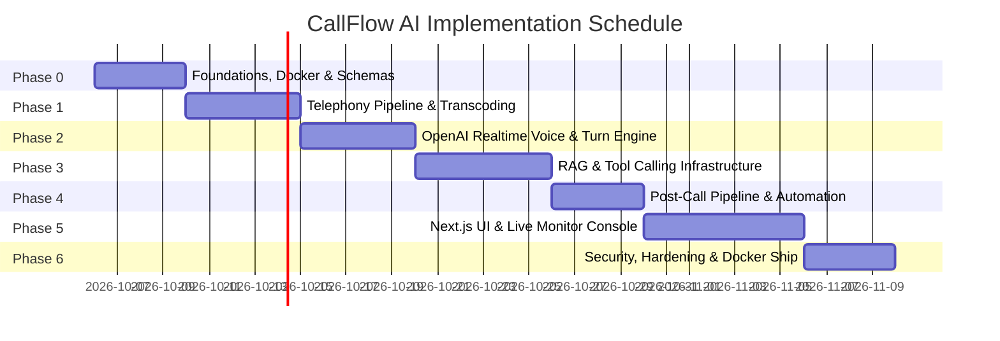

# CALLFLOW AI — Engineering Implementation Roadmap

> **Platform Version:** 1.0.0-PROD-SPEC  
> **Development Methodology:** Phased, Test-Driven Architecture  
> **Target Delivery:** Production-Grade MVP

---

## 1. Roadmap Overview & Timeline

The roadmap is structured across **7 sequential phases (Phase 0 to Phase 6)**. Each phase produces a fully testable, verified milestone with zero placeholder code or mock shims.

---

## 2. Phase-by-Phase Execution Plan

### Phase 0: Foundations, Infrastructure & Multi-Tenant Core
**Objective:** Establish reproducible local environment, container orchestration, relational schema, and core authentication.

- **Key Deliverables:**
  1. Base directory structure (`frontend/`, `backend/`, `infra/`, `docs/`, `scripts/`, `tests/`).
  2. Multi-container `infra/docker-compose.yml` spinning up:
     - PostgreSQL 16
     - Redis 7.2
     - Qdrant Vector Engine
     - MinIO (Local S3 emulator)
     - n8n Workflow Automation
  3. SQLAlchemy 2.0 async models and initial Alembic migration covering all 20 database entities defined in `DATABASE_DESIGN.md`.
  4. Authentication micro-module (`/api/v1/auth/login`, `/refresh`, `/me`) with JWT issuing and password hashing (Argon2id).
  5. Multi-tenant context middleware enforcing tenant isolation on every incoming request.
- **Verification & Acceptance Criteria:**
  - `docker compose up -d` boots all 5 infrastructure services healthy within 30 seconds.
  - `alembic upgrade head` applies cleanly on an empty database.
  - Automated integration test verifies a user can register, login, receive a JWT, and read their profile.

---

### Phase 1: Telephony Ingress & Audio Transcoding Engine
**Objective:** Connect Twilio to backend WebSockets and establish low-latency bidirectional audio transcoding.

- **Key Deliverables:**
  1. FastAPI Twilio webhook router (`/api/v1/telephony/inbound` and `/status-callback`) with `X-Twilio-Signature` HMAC verification.
  2. High-performance asynchronous WebSocket bridge (`/ws/media-stream`) handling Twilio Media Streams protocol.
  3. Audio transcoding pipeline:
     - In-memory G.711 mu-law (8kHz) <-> Linear PCM16 (24kHz) resampling engine.
     - Frame packetization: 20ms chunking with sequence tracking.
  4. Jitter buffer and silence detection simulator.
- **Verification & Acceptance Criteria:**
  - Mock Twilio audio stream replay test: streams 8kHz mu-law audio through the WebSocket bridge, verifies flawless conversion to 24kHz PCM16 with < 3ms CPU processing overhead per frame.
  - Twilio webhook signature verification rejects forged payloads with HTTP 403.

---

### Phase 2: OpenAI Realtime Voice & Session Orchestrator
**Objective:** Establish live speech-to-speech conversational turns with OpenAI Realtime API and achieve sub-500ms conversational response latency.

- **Key Deliverables:**
  1. Asynchronous client bridge connecting FastAPI to OpenAI Realtime WebSocket (`wss://api.openai.com/v1/realtime`).
  2. Dynamic session initialization: system prompt injection, voice persona selection, and initial conversational greeting.
  3. Server-side VAD (Voice Activity Detection) tuning and automated barge-in/interruption handler:
     - Detects user speech onset during assistant audio playback.
     - Emits Twilio `clear` command to purge caller audio buffer.
     - Emits `response.cancel` to OpenAI session.
  4. Speaker turn diarization logger persisting turns to `call_transcripts`.
- **Verification & Acceptance Criteria:**
  - Live phone call placed to test phone: AI introduces itself with proper legal AI disclosure.
  - Interruption test: Interrupting the AI mid-sentence stops AI audio playback in under 300ms.

---

### Phase 3: RAG Knowledge Retrieval & Dynamic Tool Calling
**Objective:** Empower voice agent to search business facts, inspect calendar availability, and book appointments live on the call.

- **Key Deliverables:**
  1. Knowledge document ingestion pipeline: document parser (PDF/DOCX), token chunker (500 tokens with 50-token overlap), and embedding generator (`text-embedding-3-small`).
  2. Qdrant vector collection setup with multi-tenant filtering on `organization_id`.
  3. Real-time RAG tool implementation: `search_knowledge_base` answering business questions in < 180ms.
  4. Calendar & Scheduling tool: `check_calendar_availability` and `book_appointment_slot` with conflict prevention and distributed Redis locking.
  5. Qualification tool: BANT state accumulator tracking budget, authority, need, and timeline.
- **Verification & Acceptance Criteria:**
  - Caller asks: *"How much does your enterprise plan cost?"* -> Agent invokes `search_knowledge_base`, parses pricing chunk from Qdrant, and states accurate pricing verbally.
  - Caller agrees to a demo -> Agent checks calendar, negotiates time, reserves slot in `appointments`, and confirms.

---

### Phase 4: Post-Call Intelligence & Workflow Automation
**Objective:** Automatically analyze completed calls, calculate lead scores, and trigger downstream CRM/messaging workflows.

- **Key Deliverables:**
  1. Call termination hook: aggregates turn-by-turn transcripts and triggers background analysis job.
  2. Post-Call Analysis Agent (`gpt-4o-mini` with Pydantic structured output):
     - Calculates BANT composite score (0–100).
     - Identifies pain points, objections, and sentiment trajectory.
     - Generates executive summary and next action items.
  3. Communication Agent: dispatches confirmation SMS via Twilio and calendar email invite.
  4. n8n integration webhook: sends enriched call payload to trigger external CRM synchronization (HubSpot/Salesforce webhook template).
- **Verification & Acceptance Criteria:**
  - Within 10 seconds of call hangup:
    - `call_summaries` and `lead_scores` records are populated in database.
    - Confirmation SMS arrives on caller handset.
    - Test n8n workflow executes and receives structured payload.

---

### Phase 5: Next.js Frontend Dashboard & Live Call Supervision
**Objective:** Deliver an intuitive, modern, real-time web portal for sales reps and supervisors.

- **Key Deliverables:**
  1. Next.js 15 (App Router) frontend with TypeScript and Tailwind CSS styled with shadcn/ui.
  2. Live Operations Dashboard: active call cards, ongoing call duration, live sentiment meter.
  3. Live Audio & Transcript Stream: WebSocket connection (`/ws/live-dashboard/{org_id}`) rendering real-time streaming speech transcription.
  4. Supervisor Intervention Console:
     - Audio monitor (listening to live phone stream in browser).
     - Supervisor Whisper mode (injects coaching instructions into agent).
     - One-click Human Takeover (triggers Twilio warm transfer).
  5. Campaign & Lead Manager: CSV lead upload, cadence configuration, and manual "Call Now" trigger.
  6. Knowledge Base UI: drag-and-drop document uploader with chunk inspection.
- **Verification & Acceptance Criteria:**
  - Dashboard updates in real time without browser page reload when a call initiates and concludes.
  - Supervisor audio stream plays live call audio in browser with < 500ms delay.

---

### Phase 6: Production Hardening, Security & Container Deployment
**Objective:** Audit, harden, benchmark, and package the complete system for cloud deployment.

- **Key Deliverables:**
  1. End-to-end security audit: PII scrubbing, rate limiting verification, prompt injection fuzzing.
  2. Automated test suite (unit tests, integration tests, mock telephony stream stress tests).
  3. Load testing: simulate 20 concurrent bidirectional audio streams without audio underrun or dropped frames.
  4. Production Docker images (multi-stage builds for frontend and backend) and Kubernetes/Docker Swarm deployment manifests.
- **Verification & Acceptance Criteria:**
  - Test suite passes with > 85% branch coverage on core telephony and agent runtime modules.
  - Production container images build cleanly with zero critical CVE vulnerabilities.
