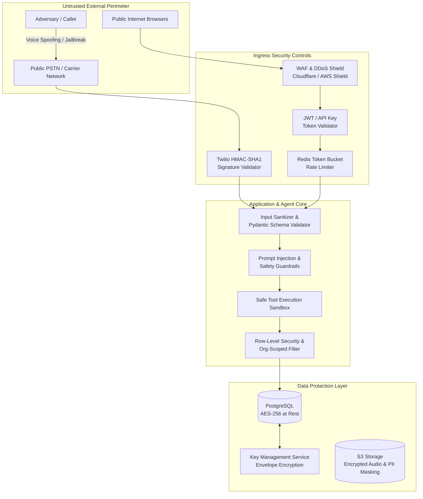

# CALLFLOW AI — Security, Compliance & Safety Architecture

> **Platform Version:** 1.0.0-PROD-SPEC  
> **Security Posture:** Zero-Trust Ingress, Strict Multi-Tenant Isolation, Defense-in-Depth  
> **Compliance Alignment:** TCPA (Telemarketing Sales Rule), FCC AI Voice Mandates, GDPR/CCPA, SOC2 Type II controls

---

## 1. Threat Model & Attack Surface

CallFlow AI operates on public telephony networks and exposed WebSockets. The primary attack vectors and security boundaries are analyzed below:



---

## 2. Telephony Security & Signature Validation

### 2.1 Twilio Webhook Signature Verification
All incoming HTTP requests to `/api/v1/telephony/*` must be verified using the `X-Twilio-Signature` header to prevent spoofing.

- **Algorithm:** HMAC-SHA1 of full URL + sorted POST form parameters, hashed against `TWILIO_AUTH_TOKEN`.
- **Implementation Guarantee:**
```python
from twilio.request_validator import RequestValidator
from fastapi import Request, HTTPException, Security

async def verify_twilio_signature(request: Request):
    validator = RequestValidator(settings.TWILIO_AUTH_TOKEN)
    signature = request.headers.get("X-Twilio-Signature", "")
    url = str(request.url)
    form_data = await request.form()
    
    if not validator.validate(url, dict(form_data), signature):
        raise HTTPException(status_code=403, detail="Invalid Twilio signature")
```

### 2.2 WebSocket Streaming Handshake Security
- The WebSocket media stream endpoint (`/ws/media-stream`) only accepts connections if the initial `start` message contains a valid `callSid` that matches an actively tracked call record in Redis generated by our authenticated backend.
- Any stream attempting to connect with an unknown `callSid` is terminated with WebSocket close code `4403 (Forbidden)`.

---

## 3. Authentication & Role-Based Access Control (RBAC)

### 3.1 Authentication Tokens
1. **Access Tokens:** Signed with asymmetric RS256 or high-entropy HS256 (`JWT_SECRET`, min 256 bits).
   - Lifetime: **15 minutes**.
   - Claims: `sub` (User UUID), `org_id` (Tenant UUID), `role` (Role name), `permissions` (Scope array).
2. **Refresh Tokens:** Cryptographically random 256-bit strings stored in Redis with SHA-256 hash.
   - Lifetime: **7 days** with sliding expiration.
   - Single-use rotation: Refreshing a token immediately invalidates the prior token.
3. **Machine API Keys:**
   - Format: `cfk_live_<32_random_alphanumeric_characters>`.
   - Stored in database as Argon2id or bcrypt hashes; raw key displayed to user only once at generation time.

### 3.2 RBAC Permission Matrix

| Role | Calls (Initiate/Listen) | Leads (CRUD) | Campaigns (Manage) | Knowledge (Upload) | Org & Billing (Admin) |
|---|---|---|---|---|---|
| **SuperAdmin** | Full | Full | Full | Full | Full |
| **OrgAdmin** | Full | Full | Full | Full | Full (Own Org) |
| **Supervisor**| Listen / Whisper / Terminate | Read / Update | Read / Pause | Read | None |
| **SalesRep** | Initiate / Read Own | Read / Update Assigned | None | Read | None |
| **ReadOnly** | Read (Masked PII) | Read (Masked PII) | Read | Read | None |

---

## 4. Prompt Injection Defense & AI Safety

Voice calls present unique jailbreak vectors where a caller might attempt to trick the AI into agreeing to unauthorized discounts, making legally binding statements, or revealing proprietary instructions.

### 4.1 Multi-Layer Defense Architecture
1. **Structural Delimiters:** System prompts strictly separate organizational instructions from dynamic user inputs using explicit tags (`<system_instructions>`, `<business_facts>`, `<user_input>`).
2. **Tool Execution Whitelisting:** The LLM cannot execute raw SQL or shell commands. Every tool executes a tightly bound Pydantic schema with strict range and enum validation.
3. **Guardrail Interceptors:**
   - **Contract Disallowance:** The agent system prompt strictly forbids verbal agreement to legal terms or unauthorized discounts:
     *"You have no authority to discount prices beyond listed tiers or alter terms of service."*
   - **Financial Protection:** The booking and CRM tools reject any payload attempting to modify billing rates or account credits.
4. **Output Hallucination Filter:** Answers regarding pricing or capabilities that lack a supporting citation from the Qdrant retrieval result trigger automated fallback response logic.

---

## 5. Regulatory Compliance & Legal Mandates

### 5.1 FCC AI Voice Disclosure Mandate
In compliance with FCC regulations and state-level conversational AI statutes:
- **Mandatory First-Sentence Disclosure:** The AI must explicitly state in its opening turn:  
  *"Hello, this is an automated AI assistant calling on behalf of [Company]."*
- **Tone & Transparency:** The agent must never deny being an AI if directly asked (*"Are you a robot?"* -> *"Yes, I'm an AI assistant built to help with scheduling..."*).

### 5.2 TCPA & Calling Time Windows
- **Calling Hours Enforcement:** The campaign dialer automatically queries the recipient's area code and geolocates timezone to restrict calls strictly between **8:00 AM and 9:00 PM local recipient time**.
- **Automated DNC (Do-Not-Call) Opt-Out:**
  - If a user utters any opt-out phrase (*"Stop calling me"*, *"Add me to your do not call list"*, *"Unsubscribe"*):
    1. The agent immediately acknowledges and apologizes.
    2. The `update_crm_lead` tool is called immediately with `lead_stage = 'do_not_call'`.
    3. The phone number is added to the tenant-wide DNC table and campaign execution for this lead is permanently terminated.
    4. Call is politely disconnected.

---

## 6. Data Privacy, PII Protection & Encryption

### 6.1 Data at Rest & in Transit
- **In Transit:** TLS 1.3 enforced on all REST and WebSocket connections.
- **At Rest:** Database volumes encrypted with AES-256. Integration tokens (Twilio Auth Tokens, OpenAI API keys) are envelope-encrypted using AES-GCM-256 before storage in PostgreSQL.
- **Audio Recordings in S3:** Encrypted via AWS KMS or S3 Server-Side Encryption (SSE-S3).

### 6.2 PII Masking & Redaction
1. **Log Sanitization:** Regex filters intercept all log emissions to mask credit card numbers, US Social Security Numbers, and international phone numbers.
2. **Audio Transcript Scrubbing:** Post-call transcripts pass through a PII scrubber prior to long-term storage in `call_transcripts` to redact spoken credit cards or sensitive health data.

---

## 7. Rate Limiting & Denial of Service Protection

- **Public REST APIs:** Redis-backed sliding window rate limiter:
  - Unauthenticated routes (`/login`): 10 requests / minute per IP.
  - Authenticated routes: 300 requests / minute per tenant user.
- **Telephony Ingress:** Twilio concurrency limits configured per organization to prevent runaway phone bill exhaustion.
- **Circuit Breakers:** If OpenAI Realtime API failure rate exceeds 5% over 1 minute, outbound campaign dialers pause automatically to prevent failed call charges.
